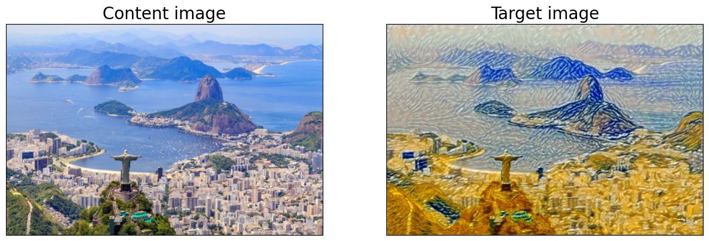

[🇧🇷] [Lê em português](./README-pt.md)

# Neural Style Transfer with Neural Networks

This repository contains a **Jupyter Notebook** that implements 
the **Neural Style Transfer (NST)** technique. The goal is to combine 
the structure of a **content image** with the artistic appearance of 
a **style image**. The method uses the **pre-trained VGG19** convolutional 
neural network to extract and manipulate features from both images.

## Project Features

- **Neural Style Transfer** implementation based on *Deep Learning*.
- Uses **VGG19** for feature extraction.
- Computes the **Gram Matrix** for style transfer.
- Optimizes the final image using **Adam**.
- Downloads content and style images during the notebook execution.

## Code Structure

### 1. Loading the VGG19 Network

- Only the **features** part of the network is loaded.
- The model weights are frozen to prevent retraining.

### 2. Loading and Processing Images

- The content and style images are loaded.
- Resizing and normalization are applied to ensure compatibility with VGG19.

### 3. Feature Extraction

- The image is passed through specific convolutional layers of VGG19.
- A mapping of layers to **content and style representations** is generated.

### 4. Computing the Gram Matrix

- The **Gram Matrix** is calculated to measure the correlation between the convolutional filters of the style image.
- This step helps capture the **textural patterns** of the chosen artwork.

### 5. Optimizing the Final Image

- The initial image is iteratively adjusted to minimize **content and style losses**.
- The loss function combines:
  - **Content loss** (difference between the content representation of the generated and original images).
  - **Style loss** (difference between the Gram matrices of the generated and style images).
- The **Adam Optimizer** is used to adjust the pixels of the generated image.

## Dependencies

To run this project, install the following libraries:

```bash
pip install torch torchvision numpy matplotlib pillow
```

## Execution

To run the Jupyter Notebook, follow these steps:

1. Clone this repository:
   ```bash
   git clone https://github.com/your-username/neural-style-transfer.git
   cd neural-style-transfer
   ```
2. Install the dependencies as indicated above.
3. Run the Jupyter Notebook:
   ```bash
   jupyter notebook
   ```
4. Open the `.ipynb` file and execute the cells sequentially.

> To run directly on Google Colab, [click here](https://colab.research.google.com/github/ericshantos/neural_style_transfer/blob/main/working_with_style_transfer.ipynb)

## Results

At the end of the execution, the generated image will present the structure of the content image combined with the stylistic features of the style image. This approach is widely used for artistic applications, image filter creation, and AI-generated digital art.

### Obtained Result



## License

This project is licensed under the **MIT License**. See the `LICENSE` file for more details.